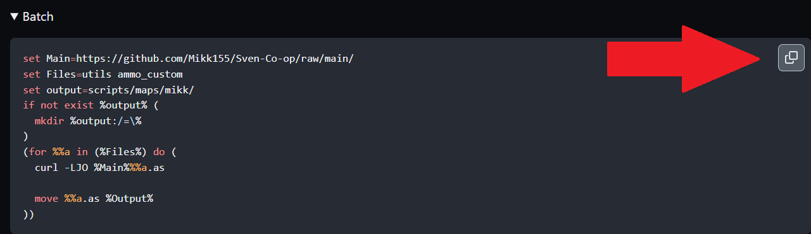

English

### Batch file

- Usa cualquier editor de texto crea un archivo y guardalo como ``.bat`` ( [Batch file](https://en.wikipedia.org/wiki/Batch_file) ) dentro de ``%Ruta a steam%//Sven Co-op/svencoop_addon/install.bat``

- Dale click derecho y ``editar``

- en el MD del script de tu interes, abre la categoria ``Instalar``

- Copia el codigo y pegalo en tu archivo

- Guardar y cerar

- ejecuta el archivo

- Listo, los archivos necesarios han sido descargados e instalados en el sitio correcto.

Spanish

### Batch file

- Usa cualquier editor de texto crea un archivo y guardalo como ``.bat`` ( [Batch file](https://en.wikipedia.org/wiki/Batch_file) ) dentro de ``%Ruta a steam%//Sven Co-op/svencoop_addon/install.bat``

- Dale click derecho y ``editar``

- en el MD del script de tu interes, abre la categoria ``Instalar``

- Copia el codigo y pegalo en tu archivo

- Guardar y cerar

- ejecuta el archivo

- Listo, los archivos necesarios han sido descargados e instalados en el sitio correcto.

