### ammo_

Entidades de munición y armas de Sven Co-op

Todas soportan la base [pickup](pickup_spanish.md)

- Comportamiento de [activación](triggering_system_english.md)

| USE_TOGGLE | USE_OFF | USE_ON | USE_SET | target !activator | target USE_TYPE |
|------------|---------|--------|---------|------------|--------|
| Añade item a !activator | | Añade item a !activator | Añade item a !activator | !activación | USE_TOGGLE |

---

### ammo_357


- Otorga por item: 6

- Capacidad maxima: 36

Armas que utilizan esta munición:
| [weapon_357](weapons_spanish.md#weapon_357) | [weapon_eagle](weapons_spanish.md#weapon_eagle) |
| :---: | :---: |
|  |  |

---

### ammo_556

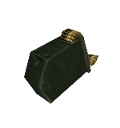

- Otorga por item: 100

- Capacidad maxima: 600

Armas que utilizan esta munición:
| [weapon_m16](weapons_spanish.md#weapon_m16) | [weapon_m249](weapons_spanish.md#weapon_m249) | [weapon_minigun](weapons_spanish.md#weapon_minigun) |
| :---: | :---: | :---: |
| 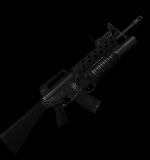 | 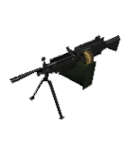 | 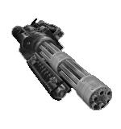 |

---

### ammo_556clip

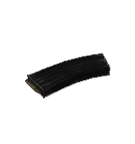

- Otorga por item: 30

- Capacidad maxima: 600

Armas que utilizan esta munición:
| [weapon_m16](weapons_spanish.md#weapon_m16) | [weapon_m249](weapons_spanish.md#weapon_m249) | [weapon_minigun](weapons_spanish.md#weapon_minigun) |
| :---: | :---: | :---: |
|  |  |  |

---

### ammo_762

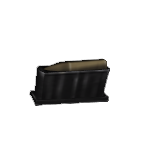

- Otorga por item: 5

- Capacidad maxima: 15

Armas que utilizan esta munición:
| [weapon_sniperrifle](weapons_spanish.md#weapon_sniperrifle) |
| :---: |
| 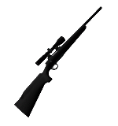 |

---

### ammo_9mmAR


- Otorga por item: 50

- Capacidad maxima: 250

Armas que utilizan esta munición:
| [weapon_uzi](weapons_spanish.md#weapon_uzi) | [weapon_9mmhandgun](weapons_spanish.md#weapon_9mmhandgun) | [weapon_9mmAR](weapons_spanish.md#weapon_9mmAR) |
| :---: | :---: | :---: |
| 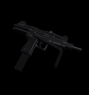 | 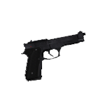 |  |

---

### ammo_9mmbox

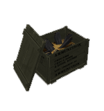

- Otorga por item: 200

- Capacidad maxima: 250

Armas que utilizan esta munición:
| [weapon_uzi](weapons_spanish.md#weapon_uzi) | [weapon_9mmhandgun](weapons_spanish.md#weapon_9mmhandgun) | [weapon_9mmAR](weapons_spanish.md#weapon_9mmAR) |
| :---: | :---: | :---: |
|  |  |  |

---

### ammo_9mmclip

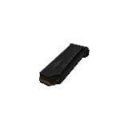

- Otorga por item: 17

- Capacidad maxima: 250

Armas que utilizan esta munición:
| [weapon_uzi](weapons_spanish.md#weapon_uzi) | [weapon_9mmhandgun](weapons_spanish.md#weapon_9mmhandgun) | [weapon_9mmAR](weapons_spanish.md#weapon_9mmAR) |
| :---: | :---: | :---: |
|  |  |  |

- Para equiparla mediante [CFG](../game/cfg_spanish.md#equipment) se debe utilizar ``ammo_9mm``

---

### ammo_ARgrenades

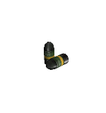

- Otorga por item: 2

- Capacidad maxima: 10

Armas que utilizan esta munición:
| [weapon_m16](weapons_spanish.md#weapon_m16) |
| :---: |
|  |

---

### ammo_buckshot

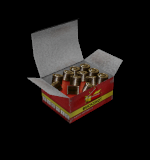

- Otorga por item: 12

- Capacidad maxima: 126

Armas que utilizan esta munición:
| [weapon_shotgun](weapons_spanish.md#weapon_shotgun) |
| :---: |
| 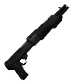 |

---

### ammo_crossbow

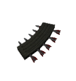

- Otorga por item: 5

- Capacidad maxima: 50

Armas que utilizan esta munición:
| [weapon_crossbow](weapons_spanish.md#weapon_crossbow) |
| :---: |
| 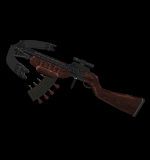 |

---

### ammo_custom


- Otorga por item: Elegida

- Capacidad maxima: Dependiente

ammo_custom es una entidad hecha en Angelscript que permite elegir cuanta munición darle a el jugador y no siempre la cantidad por defecto del juego que los items otorgan.

<details><summary>Instalar</summary>
<p>

Requiere:
- [ammo_custom](../../../scripts/maps/mikk/ammo_custom.as)
- [utils](../../../scripts/maps/mikk/utils.as)

[Descarga con un toque](../batch_spanish.md)

<details><summary>Batch</summary>
<p>

```bat
set Main=https://github.com/Mikk155/Sven-Co-op/raw/main/
set Files=utils ammo_custom
set output=scripts/maps/mikk/
if not exist %output% (
  mkdir %output:/=\%
)
(for %%a in (%Files%) do (
  curl -LJO %Main%%%a.as
  
  move %%a.as %Output%
)) 
```

</p>
</details>

En tu map_script Agrega:
```angelscript
#include "mikk/ammo_custom"

void MapInit()
{
	ammo_custom::Register();
}
```

</p>
</details>

### Values

| key | value | description |
|-----|-------|-------------|
| model | string | define un modelo |
| p_sound | string | define un sonido personalizado para cuando el item es tomado |
| am_name | [choices](#am_name) | define el tipo de munición que este item dará |
| am_give | integer | cantidad de munición que este item dará |
| frags | integer | cuantas veces este item puede ser tomado por cada jugador, si es 0 se puede tomar infinitamente, si es 1 todos los jugadores podrán tomarlo una vez cada uno ( El objeto se hace invisible para el jugador que lo haya tomado esa cantidad de veces ) |

### am_name

- buckshot
- 9mm
- ARgrenades
- sporeclip
- rockets
- uranium
- bolts
- 556
- 357
- m40a1
- satchel
- Trip Mine
- Hand Grenade
- snarks

---

### ammo_gaussclip

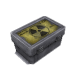

- Otorga por item: 20

- Capacidad maxima: 100

Armas que utilizan esta munición:
| [weapon_egon](weapons_spanish.md#weapon_egon) | [weapon_gauss](weapons_spanish.md#weapon_gauss) | [weapon_displacer](weapons_spanish.md#weapon_displacer) |
| :---: | :---: | :---: |
| 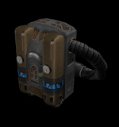 | 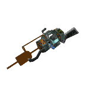 | 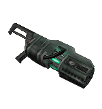 |

---

### ammo_rpgclip

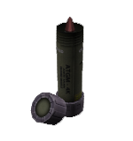

- Otorga por item: 1

- Capacidad maxima: 5

Armas que utilizan esta munición:
| [weapon_rpg](weapons_spanish.md#weapon_rpg) |
| :---: |
| 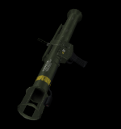 |

---

### ammo_spore

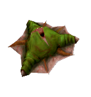

- Otorga por item: 1

- Capacidad maxima: 30

Armas que utilizan esta munición:
| [weapon_sporelauncher](weapons_spanish.md#weapon_sporelauncher) |
| :---: |
| 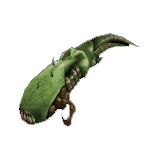 |

---

### ammo_sporeclip

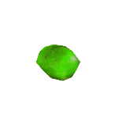

- Otorga por item: 1

- Capacidad maxima: 30

Armas que utilizan esta munición:
| [weapon_sporelauncher](weapons_spanish.md#weapon_sporelauncher) |
| :---: |
|  |

---

### ammo_uziclip

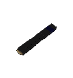

- Otorga por item: 32

- Capacidad maxima: 250

Armas que utilizan esta munición:
| [weapon_uzi](weapons_spanish.md#weapon_uzi) | [weapon_9mmhandgun](weapons_spanish.md#weapon_9mmhandgun) | [weapon_9mmAR](weapons_spanish.md#weapon_9mmAR) |
| :---: | :---: | :---: |
|  |  |  |