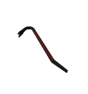

English

### weapon_crowbar

Soporta la base [weapon_](weapon_.md)

### CVars

- mp_dropweapons
  - 0 No se puede utilizar el ataque terciario

- sk_plr_crowbar
  - Daño de el arma al golpear.

- Ataque secundario
  - [Donadores](../../game/donors.md) pueden utilizar el disparo secundario para electrificar su palanca, al golpear, esto consumirá energia del traje HEV a cambio de hacer el doble de daño

- Ataque terciario
  - Puedes lanzar la palanca para alcanzar objetivos a distancia

Español

### weapon_crowbar

Soporta la base [weapon_](weapon_.md)

### CVars

- mp_dropweapons
  - 0 No se puede utilizar el ataque terciario

- sk_plr_crowbar
  - Daño de el arma al golpear.

- Ataque secundario
  - [Donadores](../../game/donors.md) pueden utilizar el disparo secundario para electrificar su palanca, al golpear, esto consumirá energia del traje HEV a cambio de hacer el doble de daño

- Ataque terciario
  - Puedes lanzar la palanca para alcanzar objetivos a distancia

