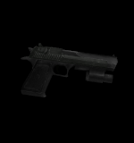

English

### weapon_eagle

Soporta la base [weapon_](weapon_.md)

### CVars

- weaponmode_eagle
  - 0 Se puede utilizar laser con alternative fire.
  - 1 No se puede utilizar laser con alternative fire.

- sk_plr_357_bullet
  - Daño de el arma al disparar.

### Capacidad

Cantidad de munición: 7

Capacidad maxima: 36

### Tipo de municion

| ammo_357 |
| :---: |
|  |

Español

### weapon_eagle

Soporta la base [weapon_](weapon_.md)

### CVars

- weaponmode_eagle
  - 0 Se puede utilizar laser con alternative fire.
  - 1 No se puede utilizar laser con alternative fire.

- sk_plr_357_bullet
  - Daño de el arma al disparar.

### Capacidad

Cantidad de munición: 7

Capacidad maxima: 36

### Tipo de municion

| ammo_357 |
| :---: |
|  |

