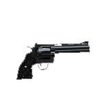
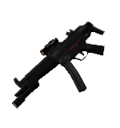
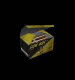

### weapons

Base de valores que todas las armas comparten.

Soportan la base [pickup](../pickup_spanish.md).

| Key | Value | Descripción |
|-----|-------|-------------|
| dmg | integer | Daño personalizado independiente de sus cvars en [skill.cfg](../../game/skill.md) |
| wpn_v_model | string | Modelo personalizado para la vista de primera persona |
| wpn_w_model | string | Modelo personalizado para la vista de el objeto en el mundo |
| wpn_p_model | string | Modelo personalizado para la vista de el objeto en las manos de otro jugador |
| soundlist | string | [GSR](../../game/gsr_spanish.md) para esta arma |
| CustomSpriteDir | string | directorio personalizado para el archivo de sprite de esta arma |
| IsNotAmmoItem | 0/1 | 0 = se puede volver a recoger para tomar su municion, 1 = solo se puede tomar para recibir el arma |
| exclusivehold | 0/1 | 0 = funcion normal, 1 = al tomar el arma no puedes cambiar a otra arma a no ser que esta sea descartada (+drop) |

| classname | preview |
|-----------| :-----: |
[weapon_357](#weapon_357) | 
[weapon_9mmAR](#weapon_9mmAR) | 

---

### weapon_357

- CVars
	- weaponmode_357
		- 0 Se puede utilizar zoom con alternative fire.
		- 1 No se puede utilizar zoom con alternative fire.

	- sk_plr_357_bullet
		- Daño de el arma al disparar.

### Capacidad

Cantidad de munición: 6

Capacidad maxima: 36

### Tipo de municion

| [ammo_357](../ammo_spanish.md#ammo_357) |
| :---: |
|  |

---

