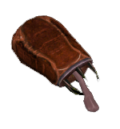
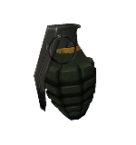
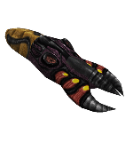
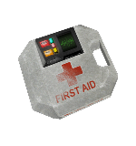
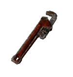
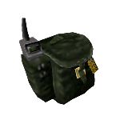
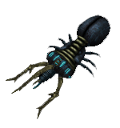
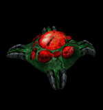
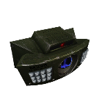
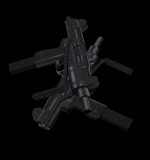

### weapons

<details><summary>Base de valores que todas las armas comparten.</summary>
<p>

Soportan la base [pickup](pickup_spanish.md).

| Key | Value | Descripción |
|-----|-------|-------------|
| dmg | integer | Daño personalizado independiente de sus cvars en [skill.cfg](../game/skill_spanish.md#player-weapons) |
| wpn_v_model | string | Modelo personalizado para la vista de primera persona |
| wpn_w_model | string | Modelo personalizado para la vista de el objeto en el mundo |
| wpn_p_model | string | Modelo personalizado para la vista de el objeto en las manos de otro jugador |
| soundlist | string | [GSR](../game/gsr_spanish.md) para esta arma |
| CustomSpriteDir | string | directorio personalizado para el archivo de sprite de esta arma |
| IsNotAmmoItem | 0/1 | 0 = se puede volver a recoger para tomar su municion, 1 = solo se puede tomar para recibir el arma |
| exclusivehold | 0/1 | 0 = funcion normal, 1 = al tomar el arma no puedes cambiar a otra arma a no ser que esta sea descartada (+drop) |

- Comportamiento de [activación](triggering_system_english.md)

| USE_TOGGLE | USE_OFF | USE_ON | USE_SET | target !activator | target USE_TYPE |
|------------|---------|--------|---------|------------|--------|
| Añade item a !activator | | Añade item a !activator | Añade item a !activator | !activación | USE_TOGGLE |

</p>
</details>

<details><summary>Lista</summary>
<p>

| classname | preview |
|-----------| :-----: |
[weapon_357](#weapon_357) | 
[weapon_9mmAR](#weapon_9mmar) | 
[weapon_9mmhandgun](#weapon_9mmhandgun) | 
[weapon_crossbow](#weapon_crossbow) | 
[weapon_crowbar](#weapon_crowbar) | 
[weapon_displacer](#weapon_displacer) | 
[weapon_eagle](#weapon_eagle) | 
[weapon_egon](#weapon_egon) | 
[weapon_gauss](#weapon_gauss) | 
[weapon_grapple](#weapon_grapple) | 
[weapon_handgrenade](#weapon_handgrenade) | 
[weapon_hornetgun](#weapon_hornetgun) | 
[weapon_m16](#weapon_m16) | 
[weapon_m249](#weapon_m249) | 
[weapon_medkit](#weapon_medkit) | 
[weapon_minigun](#weapon_minigun) | 
[weapon_pipewrench](#weapon_pipewrench) | 
[weapon_rpg](#weapon_rpg) | 
[weapon_satchel](#weapon_satchel) | 
[weapon_shockrifle](#weapon_shockrifle) | 
[weapon_shotgun](#weapon_shotgun) | 
[weapon_snark](#weapon_snark) | 
[weapon_sniperrifle](#weapon_sniperrifle) | 
[weapon_sporelauncher](#weapon_sniperrifle) | 
[weapon_tripmine](#weapon_tripmine) | 
[weapon_uzi](#weapon_uzi) | 
[weapon_uziakimbo](#weapon_uziakimbo) | 

</p>
</details>

---

### weapon_357

- CVars
	- weaponmode_357
		- 0 Se puede utilizar zoom con alternative fire.
		- 1 No se puede utilizar zoom con alternative fire.

	- sk_plr_357_bullet
		- Daño de el arma al disparar.

### Capacidad

Cantidad de munición: 6

Capacidad maxima: 36

### Tipo de municion

| [ammo_357](ammo_spanish.md#ammo_357) |
| :---: |
|  |

---

### weapon_9mmAR

- CVars
	- weaponmode_mp5
		- 0 Se puede utilizar zoom con alternative fire.
		- 1 No se puede utilizar zoom con alternative fire.

	- sk_plr_9mmAR_bullet
		- Daño de el arma al disparar.

### Capacidad

Cantidad de munición: 30

Capacidad maxima: 250

### Tipo de municion
| [ammo_9mmAR](ammo_spanish.md#ammo_9mmAR) | [ammo_9mmbox](ammo_spanish.md#ammo_9mmbox) | [ammo_9mmclip](ammo_spanish.md#ammo_9mmclip) | [ammo_uziclip](ammo_spanish.md#ammo_uziclip) |
| :---: | :---: | :---: | :---: |
|  |  |  |  |

- Esta arma tambien tiene por nombre ``weapon_mp5`` pero es recomendable registrarla como ``weapon_9mmAR``

---

### weapon_9mmhandgun

- CVars
	- weaponmode_9mmhandgun
		- 0 Se puede utilizar Rapid-Fire con alternative fire.
		- 1 Se puede utilizar silenciador con alternative fire. (Solo es visual/audible, no tiene mecanica alguna en el juego.)

	- sk_plr_9mmAR_bullet
		- Daño de el arma al disparar.

### Capacidad

Cantidad de munición: 17

Capacidad maxima: 250

### Tipo de municion
| [ammo_9mmAR](ammo_spanish.md#ammo_9mmAR) | [ammo_9mmbox](ammo_spanish.md#ammo_9mmbox) | [ammo_9mmclip](ammo_spanish.md#ammo_9mmclip) | [ammo_uziclip](ammo_spanish.md#ammo_uziclip) |
| :---: | :---: | :---: | :---: |
|  |  |  |  |

- Esta arma tambien tiene por nombre ``weapon_glock`` pero es recomendable registrarla como ``weapon_9mmhandgun``

---

### weapon_crossbow

- CVars
	- weaponmode_crossbow
		- 0 Sin zoom, las flechas crearán una explosión
		- 1 Las flechas jamas explotarán

	- sk_plr_xbow_bolt_monster
		- Daño de el arma al disparar.

### Capacidad

Cantidad de munición: 5

Capacidad maxima: 50

### Tipo de municion
| [ammo_crossbow](ammo_spanish.md#ammo_crossbow) |
| :---: |
|  |

Esta arma tambien tiene una keyvalue llamada ``sequence`` que especifica que secuencia del modelo utilizar.
```angelscript
    sequence(choices) : "Placement" : 0 =
    [
        0 : "Normal (flat)"
        1 : "Realistic (tilted)"
    ]
```

---

### weapon_crowbar

- CVars
	- mp_dropweapons
		- 0 No se puede utilizar el ataque terciario

	- sk_plr_crowbar
		- Daño de el arma al golpear.

- Ataque secundario
  - [Donadores](../game/donors_spanish.md) pueden utilizar el disparo secundario para electrificar su palanca, al golpear, esto consumirá energia del traje HEV a cambio de hacer el doble de daño

- Ataque terciario
  - Puedes lanzar la palanca para alcanzar objetivos a distancia

---

### weapon_displacer

- CVars
	- weaponmode_displacer
		- 1 El ataque terciario se puede utilizar

	- sk_plr_displacer_other
		- Daño de el arma al disparar.
	  
	 - sk_plr_displacer_radius
		- Radio de daño

### Capacidad

Cantidad de munición: Compartida

Capacidad maxima: 100

### Tipo de municion
| [ammo_gaussclip](ammo_spanish.md#ammo_gaussclip) |
| :---: |
|  |

- Ataque primario
  - Consume 20 de munición, al golpear a un objetivo, en el mayor de los casos este desaparecerá
  
- Ataque secundario
  - Consume 60 de munición, teletransporta a el portador a un lugar previamente especificado por el mapper
  
- Ataque terciario
  - Consume 50 de munición, igual al ataque primario pero mas poderoso y rapido, sin embargo tarda mas en disparar

| Key | Value | Descripción |
|-----|-------|-------------|
m_TertiaryMode | integer | Determina si el disparo terciario estará disponible o si el mapa deberia usarlo
m_flPortalSpeed | integer | Determina la velocidad del proyectil
m_flPortalRadius | integer | Determina el radio del portal
m_iszTeleportDestination | string | Nombre de un info_teleport_destination para teletransportarte mediante el ataque secundario
m_flPrimaryAmmoNeeded | integer | Coste de munición para disparar el ataque primario
m_flSecondaryAmmoNeeded | integer | Coste de municion para disparar el ataque secundario
m_flTertiaryAmmoNeeded | integer | Coste de municion para disparar el ataque terciario

| Bit | Flag | Descripción |
|-----|-------|-------------|
64 | Random Destination | Una destinación aleatoria será tomada
128 | Rotate (Dest Angles) | Rota el angulo de la destinación
256 | Keep Angles | mantiene el angulo tras teletransportarse
512 | Keep velocity | Mantiene la velocidad tras teletransporse
4096 | Ignore Delays | ignora el tiempo de delay de los teletransportes

Utilizar [trigger_changevalue](trigger_changevalue_spanish.md#angelscript-function) para modificar estas keyvalues para weapon_displacer que hayan sido dados mediante CFG.

---

### weapon_eagle

- CVars
	- weaponmode_eagle
		- 0 Se puede utilizar laser con alternative fire.
		- 1 No se puede utilizar laser con alternative fire.

	- sk_plr_357_bullet
		- Daño de el arma al disparar.

### Capacidad

Cantidad de munición: 7

Capacidad maxima: 36

### Tipo de municion
| [ammo_357](ammo_spanish.md#ammo_357) |
| :---: |
|  |

---

### weapon_egon

- CVars
	- sk_plr_egon_wide
		- Daño de el arma al disparar.

### Capacidad

Cantidad de munición: Compartida

Capacidad maxima: 100

### Tipo de municion
| [ammo_gaussclip](ammo_spanish.md#ammo_gaussclip) |
| :---: |
|  |

---

### weapon_gauss

- CVars
	- mp_disablegaussjump
		- 0 función normal.
		- 1 desactiva el empuje vertical tras lanzar un ataque cargado.

	- sk_plr_gauss
		- Daño de el arma al disparar.

	- sk_plr_secondarygauss
		- Daño de el arma al disparar completamente cargada.

### Capacidad

Cantidad de munición: Compartida

Capacidad maxima: 100

### Tipo de municion
| [ammo_gaussclip](ammo_spanish.md#ammo_gaussclip) |
| :---: |
|  |

---

### weapon_grapple

- CVars
	- mp_grapple_mode
		- 0 Desactiva la atracción
		- 1 Puedes ser atraido hacia monsters, pequeños monsters como headcrabs seran atraidos hacia ti en su lugar

	- mp_disable_player_rappel
		- 0 Función normal.
		- 1 Puedes ser atraido hacia jugadores.

	- sk_plr_grapple
		- Daño de el arma al morder.
---

### weapon_handgrenade

- CVars
	- mp_banana
		- 0 Desactiva la función.
		- 1 Puedes usar el disparo secundario para lanzar 10 granadas en una explosion mas grande.

	- sk_plr_hand_grenade
		- Daño de el arma al explotar.

### Capacidad

Cantidad de munición: Compartida

Capacidad maxima: 10

---

### weapon_hornetgun

- CVars
	- sk_hornet_pdmg
		- Daño de el arma al disparar.

### Capacidad

Cantidad de munición: Infinita

Capacidad maxima: 100

---

### weapon_m16

- CVars
	- sk_556_bullet
		- Daño de el arma al disparar.

	- sk_plr_9mmAR_grenade
		- Daño de el arma al disparar una granada.

### Capacidad

Cantidad de munición: 30

Capacidad maxima: 600

### Tipo de municion
| [ammo_556](ammo_spanish.md#ammo_556) | [ammo_556clip](ammo_spanish.md#ammo_556clip) | [ammo_ARgrenades](ammo_spanish.md#ammo_ARgrenades) |
| :---: | :---: | :---: |
|  |  |  |

---

### weapon_m249

- CVars
	- sk_556_bullet
		- Daño de el arma al disparar.

### Capacidad

Cantidad de munición: 200

Capacidad maxima: 600

### Tipo de municion
| [ammo_556](ammo_spanish.md#ammo_556) | [ammo_556clip](ammo_spanish.md#ammo_556clip) |
| :---: | :---: |
|  |  |

---

### weapon_medkit

- CVars
	- sk_plr_HpMedic
		- Vida que cura el medkit.

### Capacidad

Cantidad de munición: Infinita

Capacidad maxima: 100

### Tipo de municion
| func_healthcharger | item_healthkit |
| --- | --- |

---

### weapon_minigun

- CVars
	- sk_556_bullet
		- Daño de el arma al disparar.

### Capacidad

Cantidad de munición: Compartida

Capacidad maxima: 600

### Tipo de municion
| [ammo_556](ammo_spanish.md#ammo_556) | [ammo_556clip](ammo_spanish.md#ammo_556clip) |
| :---: | :---: |
|  |  |

- exclusivehold esta forzado.

---

### weapon_pipewrench

- CVars
	- sk_plr_wrench
		- Daño de el arma al golpear.

---

### weapon_rpg

- CVars
	- weaponmode_rpg
		- 0 Función normal.
		- 1 Desactiva el laser guia.

	- sk_plr_rpg
		- Daño de el arma al disparar.

### Capacidad

Cantidad de munición: 1

Capacidad maxima: 5

### Tipo de municion
| [ammo_rpgclip](ammo_spanish.md#ammo_rpgclip) |
| :---: |
|  |

---

### weapon_satchel

- CVars
	- sk_plr_satchel
		- Daño de el arma al explotar.

### Capacidad

Cantidad de munición: Compartida

Capacidad maxima: 5

---

### weapon_shockrifle

- CVars
	- sk_shockroach_dmg_xpl_touch
		- Daño de el arma al disparar.

	- sk_shockroach_dmg_xpl_splash_bullet
		- Daño de el arma al explotar.

### Capacidad

Cantidad de munición: Compartida

Capacidad maxima: 100

- exclusivehold esta forzado.

---

### weapon_shotgun

- CVars
	- weaponmode_shotgun
		- 0 alternative fire dispara Rapid-Fire.
		- 1 alternative fire dispara a doble cañon.

	- sk_plr_buckshot
		- Daño de el arma al disparar.

### Capacidad

Cantidad de munición: 8

Capacidad maxima: 128

### Tipo de municion
| [ammo_buckshot](ammo_spanish.md#ammo_buckshot) |
| :---: |
|  |

---

### weapon_snark

- CVars
	- sk_snark_dmg_bite
		- Daño de el snark al morder.

	- sk_snark_health
		- Tiempo de vida de el snark.

	- sk_snark_dmg_pop
		- Daño de el snark al explotar.

### Capacidad

Cantidad de munición: Compartida

Capacidad maxima: 5

---

### weapon_sniperrifle

- CVars
	- sk_plr_762_bullet
		- Daño de el arma al disparar.

### Capacidad

Cantidad de munición: 5

Capacidad maxima: 15

### Tipo de municion
| [ammo_762](ammo_spanish.md#ammo_762) |
| :---: |
|  |

---

### weapon_sporelauncher

- CVars
	- sk_plr_spore
		- Daño de el arma al disparar.

### Capacidad

Cantidad de munición: Compartida

Capacidad maxima: 15

### Tipo de municion
| [ammo_spore](ammo_spanish.md#ammo_spore) | [ammo_sporeclip](ammo_spanish.md#ammo_sporeclip) |
| :---: | :---: |
|  |  |

---

### weapon_tripmine

- CVars
	- sk_plr_tripmine
		- Daño de el arma al explotar.

### Capacidad

Cantidad de munición: Compartida

Capacidad maxima: 5

---

### weapon_uzi

- CVars
	- sk_556_bullet
		- Daño de el arma al disparar.

### Capacidad

Cantidad de munición: 32

Capacidad maxima: 600

### Tipo de municion
| [ammo_556](ammo_spanish.md#ammo_556) | [ammo_556clip](ammo_spanish.md#ammo_556clip) | [ammo_ARgrenades](ammo_spanish.md#ammo_ARgrenades) |
| :---: | :---: | :---: |
|  |  |  |

---

### weapon_uziakimbo

- CVars
	- sk_556_bullet
		- Daño de el arma al disparar.

### Capacidad

Cantidad de munición: 64

Capacidad maxima: 600

### Tipo de municion
| [ammo_556](ammo_spanish.md#ammo_556) | [ammo_556clip](ammo_spanish.md#ammo_556clip) | [ammo_ARgrenades](ammo_spanish.md#ammo_ARgrenades) |
| :---: | :---: | :---: |
|  |  |  |

---