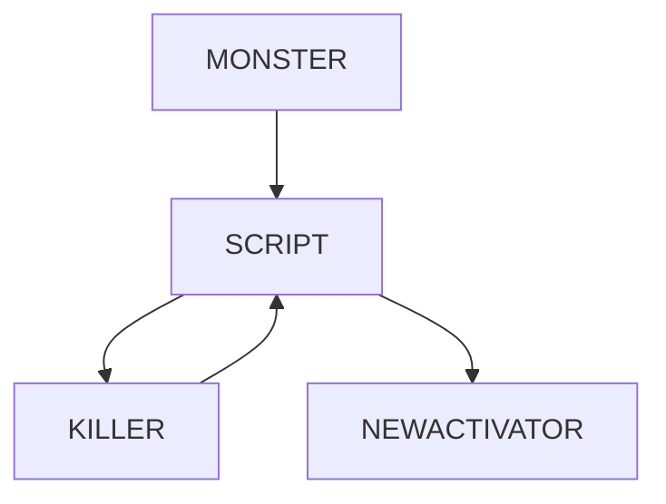

[See in english](#english)

[Leer en español](#spanish)

# ENGLISH

[callbacks.as](https://github.com/Mikk155/Sven-Co-op/blob/main/scripts/maps/mikk/callbacks.as) 
is a script with a bunch of utilities that i've decided to merge into one script all those i've find utils for common use. all of them are for the use of [trigger_script](https://sites.google.com/site/svenmanor/entguide/trigger_script). you'll see their functions explained and how to use those scripts.

[Turn the killer as activator through TriggerTarget](#getkiller)

[Activate and Deactivate survival mode](#survival)

[Implement stealth mode in co-op](#stealth)

[Render progressively an entity](#render-progresive)

[Show a timer of your selection on screen](#timer)

# GetKiller

The use of ``!activator`` is esencial when creating a map in MP mode if you want to make the correct actions to the respective player.

However in Sven Co-op the monsters Fire their actions in base of TriggerTarget and TriggerCondition they can't make the killer/attacker as ``!activator`` there is when this script works. when attacking/killing or anything else specified. you can set ``!activator`` to the attacker. but you have to set some things before.
```angelscript
"classname" "trigger_script"
"netname" "entity to make the attacker as activator"
"targetname" "the victim has to turn on the script"
"m_iszScriptFunctionName" "CTriggerScripts::GetKillerTriggerTarget"
"m_iMode" "1"
```
your monster will activate the trigger_script. then the script will make a process wich will end activating it's own netname with the attacker as ``!activator``
 


# Survival

No method exist to disable/enable survival mode from mapping with stock entities. there is where this function can be used.

This function is very simple. if survival mode is activated this will deactivate it and viceversa
```angelscript
"m_iszScriptFunctionName" "CTriggerScripts::ToggleSurvivalMode"
"m_iMode" "1"
```

# Stealth

Have you ever asked yourself how a stealth map would work in a MP game?

Very weird to be honest. But still if you want to try we made sure that you can implement it.
```angelscript
"m_iszScriptFunctionName" "CTriggerScripts::Stealth"
"m_iMode" "2"
"target" "monster"
"netname" "targetspot"
"message" "targetrelease"
```

``target`` Define the monster wich will unleash the events the moment that it sees a player.

``netname`` Define an entity where you will teleport a player after he is seen.

``message`` Define an entity to activate when the player is teleported. it will be the ``!activator``

Notas:

-  Since it is not a teleport itself. it is more a change in origin. keep in mind the position of the player.

# Render progresive

You want to make an entity's rendering fading effect but you are too lazy to create around 100 env_renders?

With this function you can change the rendering (renderamt) progressively with a simple trigger.
```angelscript
"m_iszScriptFunctionName" "CTriggerScripts::RenderProgressive"
"m_iMode" "2"
"target" "entity to affect"
"renderamt" "value to change progressively"
```
``target`` Defines an entity to affect

``renderamt`` Defines a limit value to reach proggresively.

Notas:

- The value will change in +1/-1 each time. vary the thinking time in the script will vary the rendering time.

- Multiple entities can be affected.

- The renderamt value can be changed in-game with changevalue.

# Timer

If you dont want a player to rush half of the map or that other players miss a cinematic you can make an easy counter with this script.

Shows a counter on screen. useful to create waiting rooms soo other players can join the game before starting the map. example ``The game will start in X seconds.``
```angelscript
"m_iszScriptFunctionName" "CTriggerScripts::ShowTimer"
"m_iMode" "2"
"m_flThinkDelta" "1.0"
"health" "time in seconds"
"netname" "Activate after counting down"
```
Notas: 

- The message supports multi-language and these are already defined internally in the script.

- Do not change``m_flThinkDelta`` because it will stop being 1.0 second it will not count each second.

# SPANISH

[callbacks.as](https://github.com/Mikk155/Sven-Co-op/blob/main/scripts/maps/mikk/callbacks.as) es un script con un monton de utilidades que he decidido combinar en un solo archivo a los que encontré utiles para uso común. todos ellos son accesibles con el uso de [trigger_script](https://sites.google.com/site/svenmanor/entguide/trigger_script). A continuación verás sus funciones y como usar estos scripts.

[Pasar asesino como activador a travez de TriggerTarget](#getkiller-spanish)

[Activar y desactivar el modo supervivencia](#survival-spanish)

[Implementa modo de sigilo en co-op](#stealth-spanish)

[Renderiza progresivamente una entidad](#render-progresive-spanish)

[Muestra un contador de tu eleccion en la pantalla](#timer-spanish)

# GetKiller SPANISH

El uso de ``!activator`` es algo escencial a la hora de crear un mapa en un juego MP si quieres lograr efectuar acciones al respectivo jugador.

Sin embargo en Sven Co-op los monsters que hacen Fire a sus acciones a base de TriggerTarget y TriggerCondition no pueden pasar al asesino/atacante como el ``!activator`` entonces aqui entra este script. al atacar/matar o cualquier especificado. podras obtener como ``!activator`` al atacante. pero debes preparar algunas cosas antes.
```angelscript
"classname" "trigger_script"
"netname" "entidad a pasar el atacante como activador"
"targetname" "la victima debe encender el script"
"m_iszScriptFunctionName" "CTriggerScripts::GetKillerTriggerTarget"
"m_iMode" "1"
```
tu monster va a activar el trigger_script. luego el script hará un proceso en el que terminara activando su propio netname con el atacante como ``!activator``
 


# Survival SPANISH

No existe ningun metodo para deshabilitar/habilitar el modo de supervivencia desde mapping con entidades stock. asi que esta función puede ser utilizada.

Esta función es bastante simple. si el modo de supervivencia esta activado este se desactivará y viceversa
```angelscript
"m_iszScriptFunctionName" "CTriggerScripts::ToggleSurvivalMode"
"m_iMode" "1"
```

# Stealth SPANISH

Te has preguntado alguna vez como seria un mapa de sigilo en un juego MP?

Bastante extraño para ser sincero. pero si aun asi lo quieres intentar nos hemos aseguramos de que puedas implementarlo.
```angelscript
"m_iszScriptFunctionName" "CTriggerScripts::Stealth"
"m_iMode" "2"
"target" "monster"
"netname" "targetspot"
"message" "targetrelease"
```

``target`` Define el monster que va a desencadenar los eventos en el momento en que este vea a un jugador.

``netname`` Define una entidad en donde teleportaras a el jugador que fue visto.

``message`` Define una entidad a activar cuando el jugador sea teleportado. el será el ``!activator``

Notas:

-  Ya que no es un teleport en si. es mas bien un cambio de origin. ten en cuenta la posicion del jugador.

# Render progresive SPANISH

Quieres crear un efecto de desvanecimiento pero eres demasiado perezoso como para crear alrededor de 100 env_renders?

Con esta función puedes cambiar el renderizado (renderamt) progresivamente con un simple trigger.
```angelscript
"m_iszScriptFunctionName" "CTriggerScripts::RenderProgressive"
"m_iMode" "2"
"target" "entity to affect"
"renderamt" "value to change progressively"
```
``target`` Define entidad a afectar

``renderamt`` Define valor a establecer progresivamente.

Notas:

- El valor será cambiado en +1/-1 por cada vez. variar el tiempo de pensamiento del script variará el tiempo de renderizado.

- Multiples entidades pueden ser afectadas.

- Su valor renderamt puede ser cambiado durante el juego con changevalue.

# Timer SPANISH

Si no quieres que un jugador se rushee medio mapa o los demas se pierdan cinematicas puedes hacer un contador facilmente con este script.

Muestra un contador en pantalla. util para crear salas de esperas asi mas jugadores se unen a la partida antes de comenzar el mapa. ejemplo ``El juego comenzará en X segundos.``
```angelscript
"m_iszScriptFunctionName" "CTriggerScripts::ShowTimer"
"m_iMode" "2"
"m_flThinkDelta" "1.0"
"health" "tiempo en segundos"
"netname" "Activar tras terminar de contar"
```
Notas: 

- El mensaje soporta multi-lenguaje y estos ya estan definidos internamente en el script.

- No cambiar ``m_flThinkDelta`` ya que si deja de ser 1.0 un segundo ya no será un segundo.